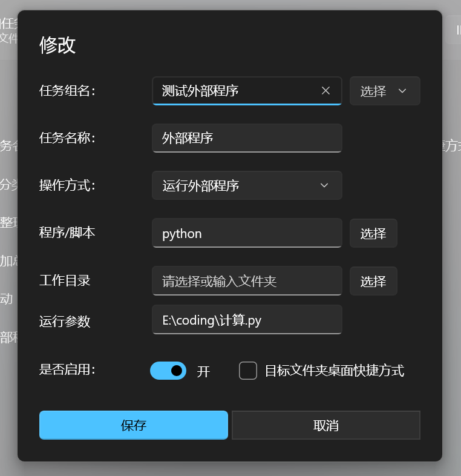

# 更新日志 (AI)

- 修复：修复翻译异常的BUG #91(不包含日志，日志暂时未做本地化)
- 修复：移动文件时，选择覆盖/重命名时源文件没有移动的问题
- 修复：备份文件恢复失败的BUG #93
- 修复：分组只有一个任务时，任务删除失败
- 变更：过滤器（高级规则）选择后直接关闭 #86
- 新增：AI分类 #90
- 新增：AI总结 #89
- 新增：执行外部程序或者命令 "脚本/程序" 填写程序路径或者名称（需要设置环境变量）工作目录可为空，参数可为空；示例 ："脚本/程序"填写或者选择 python 的路径，"工作目录" 可为空 "执行参数" 需要执行的脚本或者参数

## 版本说明

- **网盘新增不包含 WinUI 和 .NET 的版本**，更新程序暂不支持更新不包含 WinUI 3 App SDK 的版本。
- **EasyTidy_<版本号>_win-x64_Lite 版本**需要自行安装 Windows App SDK 和 .NET 8 运行时。
- 新增 **MSI 安装包** 和 **单体应用**（请在网盘中获取）。
- 要拖拽功能请不要设置源文件夹
- AI相关功能已可用；如使用存在问题，请反馈，谢谢！

## 更新日志详情

- **[Full Changelog](https://github.com/SaboZhang/EasyTidy/compare/1.2.3.218...1.2.4.305)**

## 下载链接

- [123 网盘](https://www.123684.com/s/hbzgTd-fmmt)
- [蓝奏云 (2025)](https://wwoo.lanzouu.com/b02u2ne0eh)

## 示例

如果直接填写脚本或者程序名称，则需要设置环境变量，否则需要填写全路径

