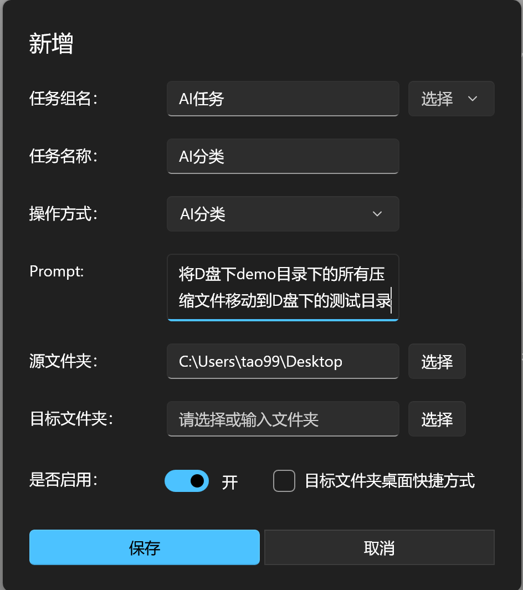

# 更新日志 (端午)

- 修复：排除规则无法正常排除
- 修复：备份文件未对热键进行备份
- 修复：日志清理失败
- 优化：添加AI任务时的错误提示

## 版本说明

- **网盘新增不包含 WinUI 和 .NET 的版本**，更新程序暂不支持更新不包含 WinUI 3 App SDK 的版本。
- **EasyTidy_<版本号>_win-x64_Lite 版本**需要自行安装 Windows App SDK 和 .NET 8 运行时。
- 新增 **MSI 安装包** 和 **单体应用**（请在网盘中获取）。
- 要拖拽功能请不要设置源文件夹
- AI相关功能已可用；如使用存在问题，请反馈，谢谢！
- AI分类支持目前已有的除外部程序调用跟AI功能本身以外的所有操作方式

## 更新日志详情

- **[Full Changelog](https://github.com/SaboZhang/EasyTidy/compare/1.3.5.524...1.3.6.531)**

## 下载链接

- [123 网盘](https://www.123684.com/s/hbzgTd-fmmt)
- [蓝奏云 (2025)](https://wwoo.lanzouu.com/b02u2ne0eh)

## 示例

在Prompt中直接说明路径的情况下，则不需要再设置路径，路径参数保持默认即可；在未明确说明路径的情况下，则需要设置AI操作的源文件夹跟目标文件夹。（可以是已存在的路径也可以是不存在的路径，会自动创建）

